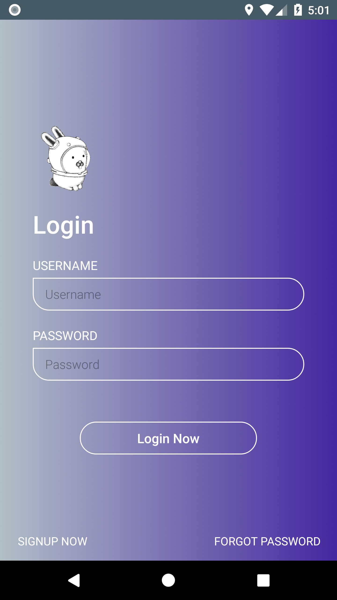
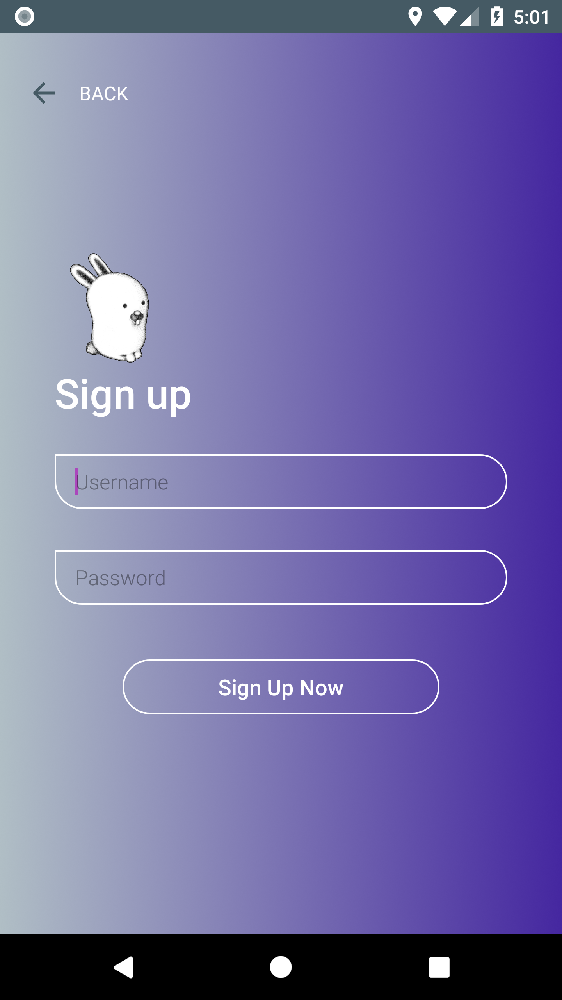
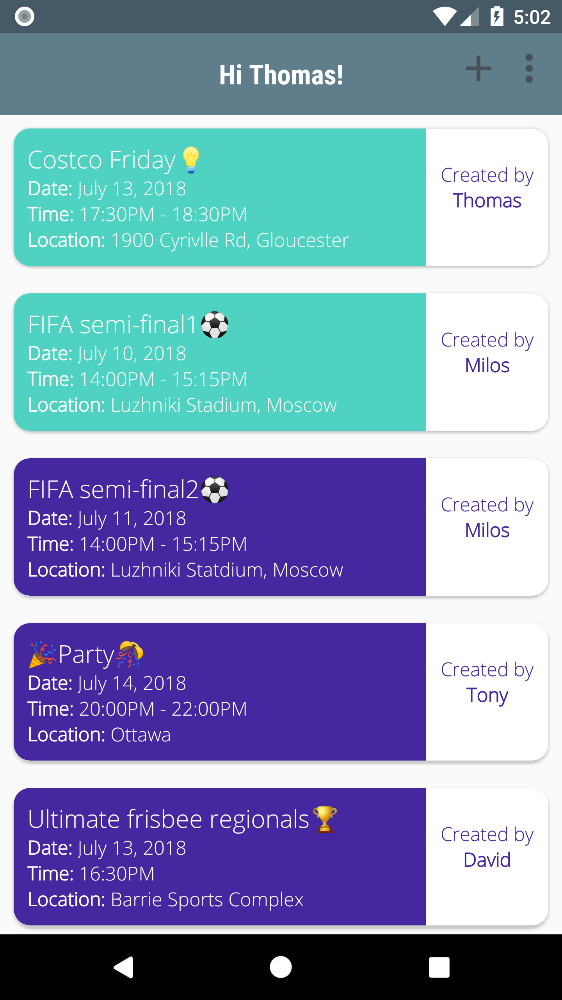
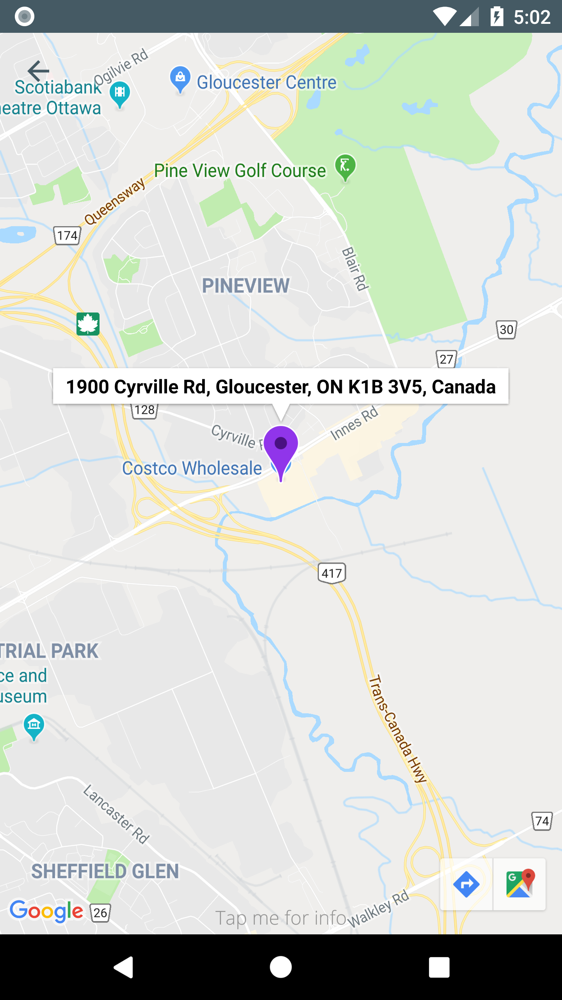
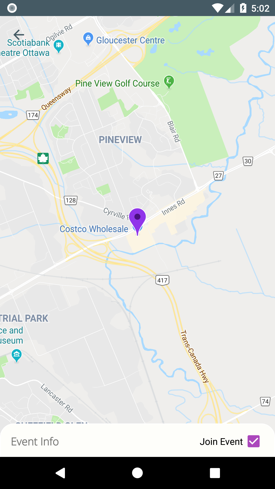
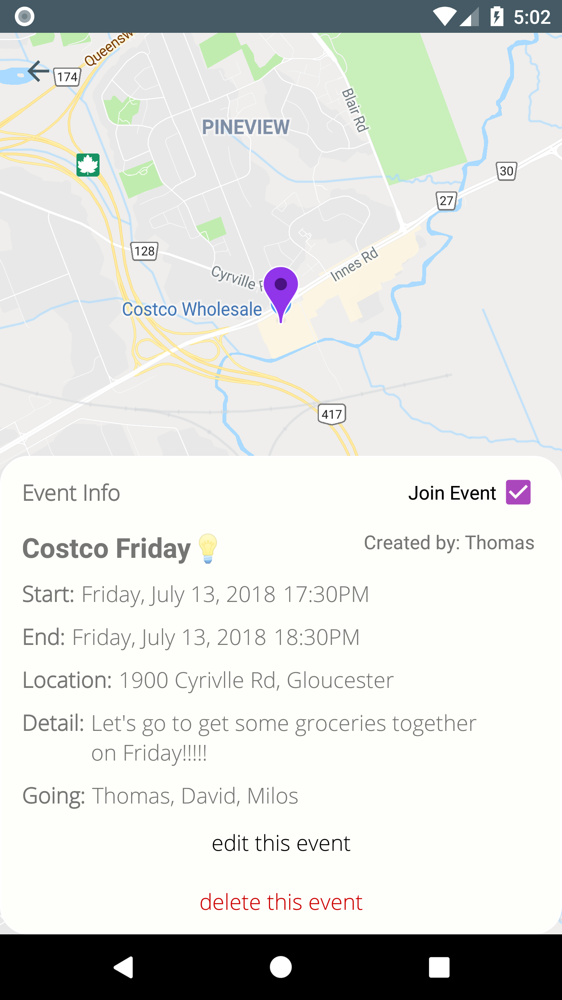
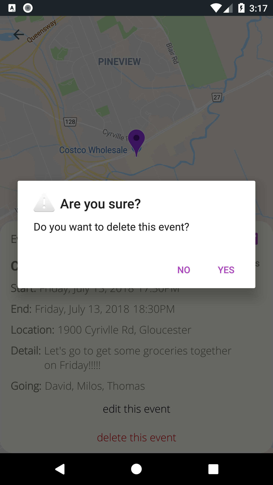
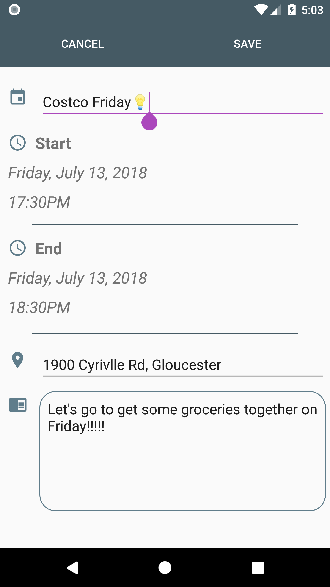
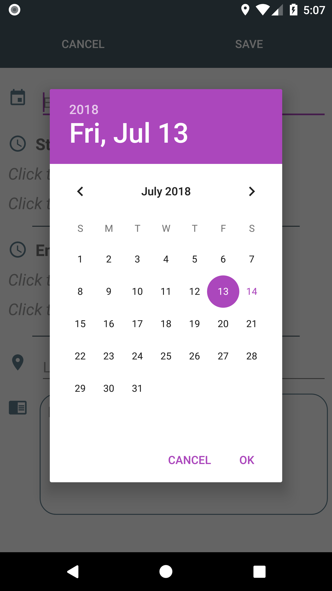
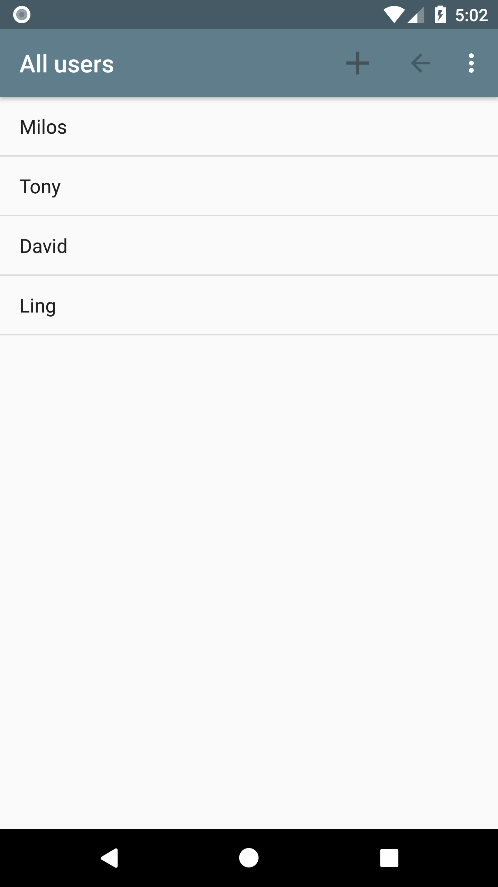

# Space
An app that helps you create and organize events for your friends to join in in real time.
The goal is to create an app that is intuitive to use and create events efficiently.

## Screenshots
#### Sign in/ sign up
&ensp;&ensp;  
p.s. I did not design the logo of the app.

#### Main page
&nbsp;&nbsp;&nbsp;&nbsp;

#### Event page
&emsp;&emsp;&emsp;

#### Create Event page and member list page
&emsp;&emsp;
